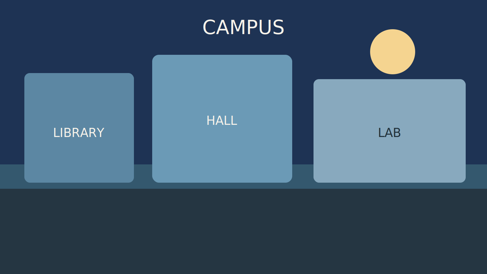
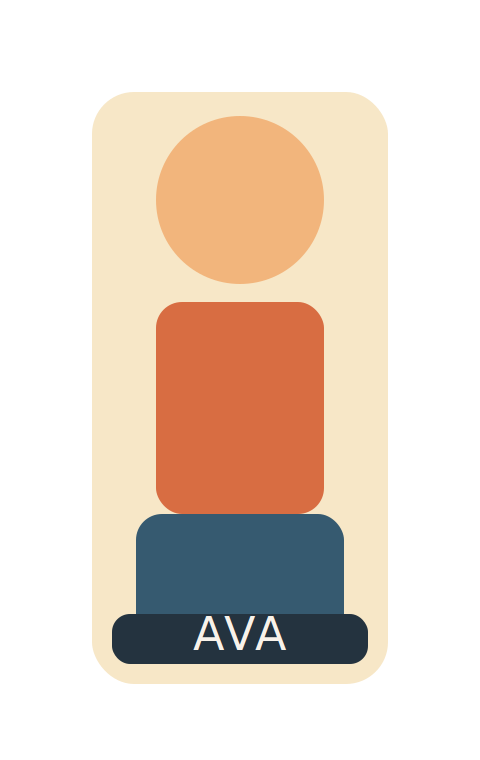

# Level 4 Visual Novel Engine

This is a first version of a small HTML/CSS/JavaScript visual novel engine built from `SPEC.md`.

It is intentionally simple:

- Scenes are regular `<section>` elements in `index.html`
- Story flow is driven by `data-step` elements inside each scene
- Global game state lives in one JavaScript object
- Branching logic stays in JavaScript actions, not in HTML

## Files

- `index.html`: scene markup, step markup, and the sample story
- `styles.css`: layout, visual styling, and character highlighting
- `scripts/engine.js`: core engine logic
- `scripts/story.js`: story-specific actions and ending logic
- `assets/images/`: flat SVG backgrounds and characters with simple text labels
- `assets/audio/`: two small WAV tones used by the sample

## Supported step types

- `say`: update the dialog box and active character
- `show`: show an element in the current scene
- `hide`: hide an element in the current scene
- `run`: call a JavaScript action
- `goto`: switch to another scene
- `wait-click`: pause until the player presses Continue
- `wait-ms`: pause for a number of milliseconds
- `choice`: render buttons and wait for a selection

## Example scene

```html
<section class="scene" id="intro-scene">
  
  

  <div class="steps" aria-hidden="true">
    <div data-step="show" data-target='[data-char="ava"]'></div>
    <div data-step="say" data-character="ava" data-speaker="Ava">
      The radio should be silent by now.
    </div>
    <div data-step="wait-click"></div>
    <div data-step="choice">
      <button type="button" data-run="chooseSignal" data-next="lab-scene">Trace the signal</button>
      <button type="button" data-run="chooseRoof" data-next="rooftop-scene">Go to the roof</button>
    </div>
  </div>
</section>
```

## Example action

```js
engine.actions.checkEnding = function (game) {
  if (game.state.investigatedSignal && game.state.hasKeycard) {
    return "clear-ending-scene";
  }

  return "storm-ending-scene";
};
```

## Run it

Open `index.html` in a browser.

For teaching, students can usually stay in three places:

- `index.html` to add scenes, steps, and choices
- `styles.css` to restyle the UI
- `scripts/story.js` to add variables, functions, and ending logic
